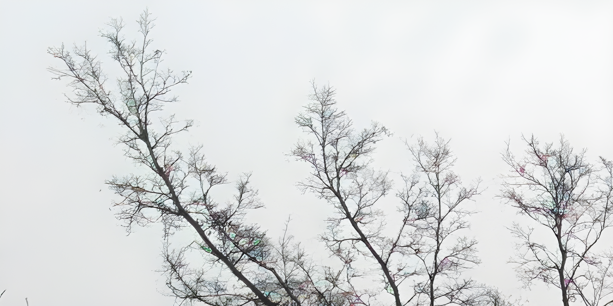

# Real_ESRGAN-PyTorch

## Overview

This repository contains an op-for-op PyTorch reimplementation of [Real-ESRGAN: Training Real-World Blind Super-Resolution with Pure Synthetic Data](https://arxiv.org/abs/2107.10833v2).

## Table of contents

- [Real_ESRGAN-PyTorch](#real_esrgan-pytorch)
    - [Overview](#overview)
    - [Table of contents](#table-of-contents)
    - [Download weights](#download-weights)
    - [Download datasets](#download-datasets)
    - [How Test and Train](#how-test-and-train)
        - [Test](#test)
        - [Train RealESRNet model](#train-realesrnet-model)
        - [Resume train RealESRNet model](#resume-train-realesrnet-model)
        - [Train RealESRGAN model](#train-realesrgan-model)
        - [Resume train RealESRGAN model](#resume-train-realesrgan-model)
    - [Result](#result)
    - [Contributing](#contributing)
    - [Credit](#credit)
        - [Real-ESRGAN: Training Real-World Blind Super-Resolution with Pure Synthetic Data](#real-esrgan-training-real-world-blind-super-resolution-with-pure-synthetic-data)

## Download weights

- [Google Driver](https://drive.google.com/drive/folders/17ju2HN7Y6pyPK2CC_AqnAfTOe9_3hCQ8?usp=sharing)
- [Baidu Driver](https://pan.baidu.com/s/1yNs4rqIb004-NKEdKBJtYg?pwd=llot)

## Download datasets

Contains DIV2K, DIV8K, Flickr2K, OST, T91, Set5, Set14, BSDS100 and BSDS200, etc.

- [Google Driver](https://drive.google.com/drive/folders/1A6lzGeQrFMxPqJehK9s37ce-tPDj20mD?usp=sharing)
- [Baidu Driver](https://pan.baidu.com/s/1o-8Ty_7q6DiS3ykLU09IVg?pwd=llot)

## How Test and Train

Both training and testing only need to modify the `config.py` file. 

### Test

- line 77: `upscale_factor` change to `4`.
- line 79: `mode` change to `test`.
- line 159: `model_path` change to `results/pretrained_models/RealESRGAN_x4-DFO2K-678bf481.pth.tar`.

### Train RealESRNet model

- line 77: `upscale_factor` change to `4`.
- line 79: `mode` change to `train_realesrnet`.
- line 81: `exp_name` change to `RealESRNet_baseline`.

### Resume train RealESRNet model

- line 77: `upscale_factor` change to `4`.
- line 79: `mode` change to `train_realesrnet`.
- line 81: `exp_name` change to `RealESRNet_baseline`.
- line 95: `resume` change to `samples/RealESRNet_baseline/g_epoch_xxx.pth.tar`.

### Train RealESRGAN model

- line 77: `upscale_factor` change to `4`.
- line 79: `mode` change to `train_realesrgan`.
- line 81: `exp_name` change to `RealESRGAN_baseline`.
- line 124: `resume` change to `results/RealESRNet_baseline/g_last.pth.tar`.

### Resume train RealESRGAN model

- line 77: `upscale_factor` change to `4`.
- line 79: `mode` change to `train_realesrgan`.
- line 81: `exp_name` change to `RealESRGAN_baseline`.
- line 124: `resume` change to `results/RealESRNet_baseline/g_last.pth.tar`.
- line 125: `resume_d` change to `samples/RealESRGAN_baseline/g_epoch_xxx.pth.tar`.
- line 126: `resume_g` change to `samples/RealESRGAN_baseline/g_epoch_xxx.pth.tar`.

### Result

Source of original paper results: [https://arxiv.org/pdf/2107.10833v2.pdf](https://arxiv.org/pdf/2107.10833v2.pdf)

In the following table, the value in `()` indicates the result of the project, and `-` indicates no test.

|   Method   | Scale | Set5 (NIQE) | Set14 (NIQE) |
|:----------:|:-----:|:-----------:|:------------:|
| RealESRNet |   4   | -(**9.80**) | -(**7.08**)  |
| RealESRGAN |   4   | -(**7.09**) | -(**4.74**)  |

```bash
# Download `RealESRGAN_x4-DFO2K-678bf481.pth.tar` weights to `./results/pretrained_models`
# More detail see `README.md<Download weights>`
python ./inference.py --inputs_path ./figure/tree_lr.png --output_path ./figure/tree_sr.png --weights_path ./results/pretrained_models/RealESRGAN_x4-DFO2K-678bf481.pth.tar`
```

Input: 

<span align="center"></span>

Output: 

<span align="center"></span>

```text
Build Real_ESRGAN model successfully.
Load Real_ESRGAN model weights `./results/pretrained_models/RealESRGAN_x4-DFO2K-678bf481.pth.tar` successfully.
SR image save to `./figure/tree_sr.png`
```

### Contributing

If you find a bug, create a GitHub issue, or even better, submit a pull request. Similarly, if you have questions,
simply post them as GitHub issues.

I look forward to seeing what the community does with these models!

### Credit

#### Real-ESRGAN: Training Real-World Blind Super-Resolution with Pure Synthetic Data

_Xintao Wang, Liangbin Xie, Chao Dong, Ying Shan_ <br>

**Abstract** <br>
Though many attempts have been made in blind super-resolution to restore low-resolution images with unknown and complex
degradations, they are still far from addressing general real-world degraded images. In this work, we extend the
powerful ESRGAN to a practical restoration application (namely, Real-ESRGAN), which is trained with pure synthetic data.
Specifically, a high-order degradation modeling process is introduced to better simulate complex real-world
degradations. We also consider the common ringing and overshoot artifacts in the synthesis process. In addition, we
employ a U-Net discriminator with spectral normalization to increase discriminator capability and stabilize the training
dynamics. Extensive comparisons have shown its superior visual performance than prior works on various real datasets. We
also provide efficient implementations to synthesize training pairs on the fly.
at [this https URL](https://github.com/xinntao/ESRGAN).

[[Paper]](https://arxiv.org/pdf/2107.10833v2.pdf) [[Author's implement(PyTorch)]](https://github.com/xinntao/Real-ESRGAN)

```bibtex
@InProceedings{wang2021realesrgan,
    author    = {Xintao Wang and Liangbin Xie and Chao Dong and Ying Shan},
    title     = {Real-ESRGAN: Training Real-World Blind Super-Resolution with Pure Synthetic Data},
    booktitle = {International Conference on Computer Vision Workshops (ICCVW)},
    date      = {2021}
}
```
